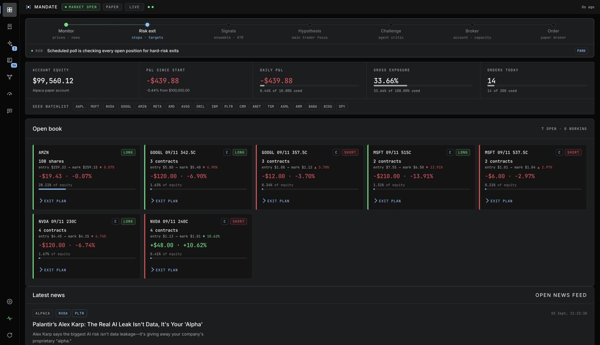
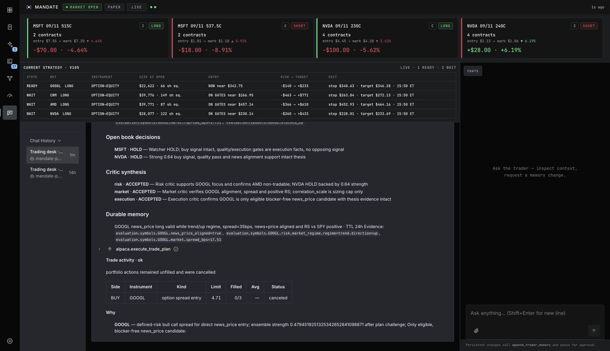
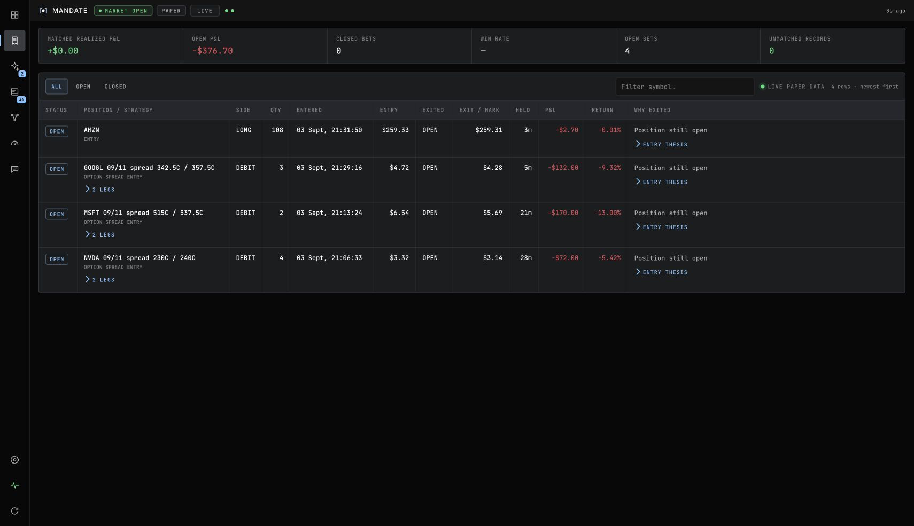
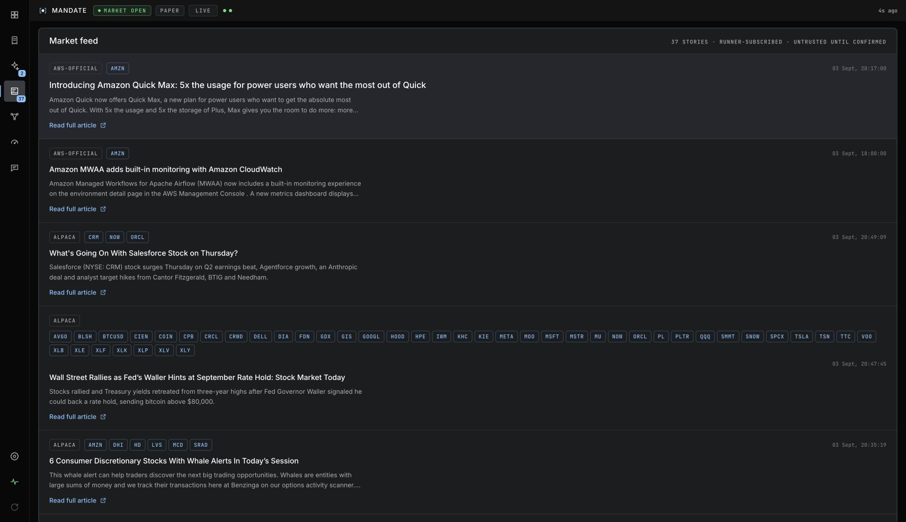
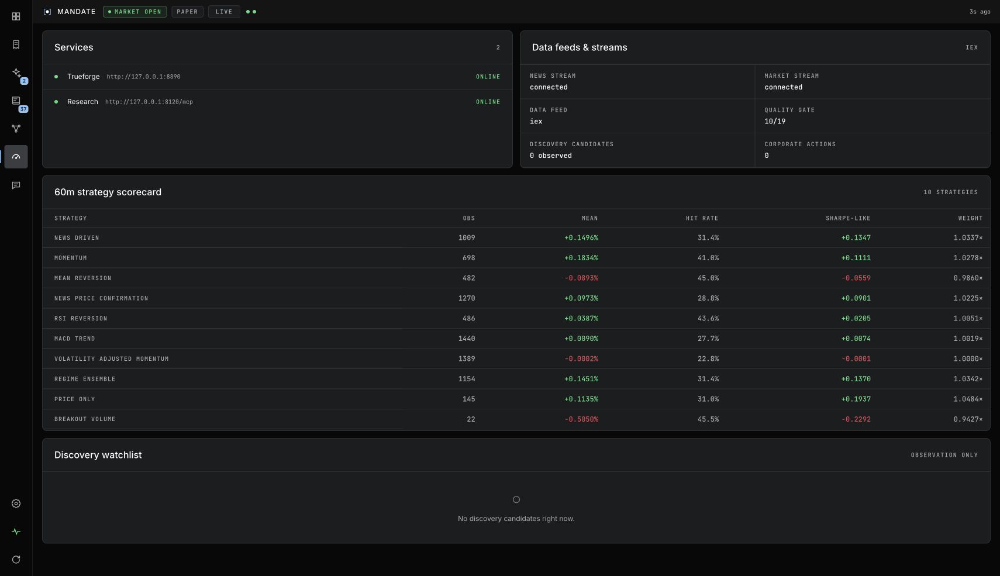
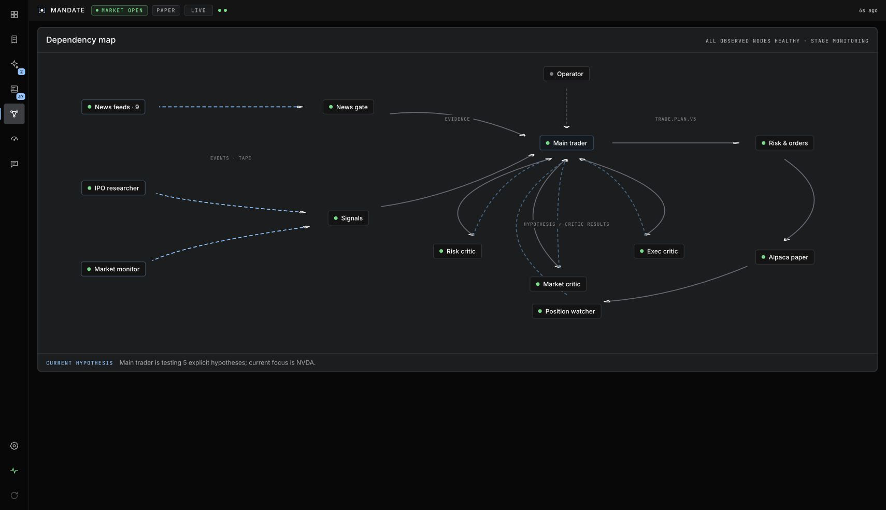
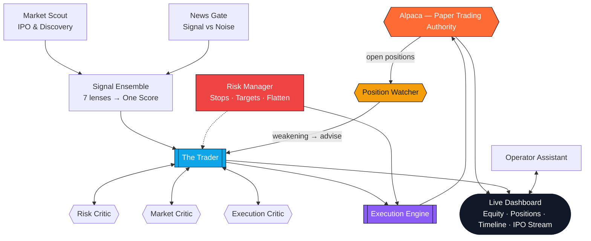

# MANDATE

  

  <strong>An autonomous trading intelligence that never sleeps.</strong> 
  <em>Built for the Alpaca AI Trading Agents Hackathon — lablab.ai × Alpaca</em>

  
  
  
  
  

  <a href="https://alpaca.miposts.com"><strong>🚀 Live Demo</strong></a> &nbsp;·&nbsp;
  <a href="#how-it-works">How It Works</a> &nbsp;·&nbsp;
  <a href="#meet-the-team">The Agents</a> &nbsp;·&nbsp;
  <a href="#architecture">Architecture</a> &nbsp;·&nbsp;
  <a href="https://alpaca.markets">Alpaca</a>

  

> **Paper trading only. Not investment advice.** MANDATE is a research prototype that trades exclusively on Alpaca's paper environment. No real money is ever at risk.

---

## See It In Action

   
  <em>Dashboard — live equity, P&L, positions and orders. Every number is real Alpaca paper data. — <a href="https://alpaca.miposts.com">🚀 Open live dashboard →</a></em>

<table>
<tr>
<td width="50%">

**Trader Timeline**

*The current strategy, hypotheses, critic synthesis, watcher verdicts and tool results — streamed as one conversation.*

</td>
<td width="50%">

**Orders & Exits**

*Every filled strategy paired with its live mark or exit, holding time, P&L and recorded exit reason.*

</td>
</tr>
<tr>
<td width="50%">

**Market Intelligence**

*Attributable market news from Alpaca and first-party sources, retained as evidence for the trader.*

</td>
<td width="50%">

**Risk & Options**

*Live service/feed health and the forward strategy scorecard that adapts ensemble weights.*

</td>
</tr>
</table>

  <strong>🎬 Video Walkthrough</strong> — <code>docs/demo/mandate-demo.mp4</code> 
  <em>Show continuous monitoring, opportunity rotation and P&L moving in real time. Required for submission.</em>

---

**[🚀 Try the live agent now](https://alpaca.miposts.com)**

*Real paper trading. Real-time streaming. No mocks.*

## Why MANDATE

<table>
<tr>
<td width="25%" align="center">

### Performance First
**Concentrated, not scattered.**
Capital rotates into the single strongest setup — then protects it.

</td>
<td width="25%" align="center">

### Truly Autonomous
**No prompts. No waiting.**
Watches the market continuously and acts the moment opportunity appears.

</td>
<td width="25%" align="center">

### Creative Edge
**Beyond the watchlist.**
Discovers movers and fresh IPOs before they hit the obvious radar.

</td>
<td width="25%" align="center">

### Built to Explain
**Every decision has a reason.**
No black boxes — timeline, evidence and critic debates are all visible.

</td>
</tr>
</table>

---

## How It Works

### The Loop — Every 3 Minutes in Market, Every 5 Minutes Off-Hours

  

| Step | What Happens | Why It Matters |
|:---:|---|---|
| **1 — Sense** | Scans live market data, news, corporate actions and the freshest IPO calendar | Nothing is missed — not even a newly listed name |
| **2 — Rank** | Scores every name through a blend of price, regime and news confirmation | Only the truly tradable survives |
| **3 — Watch** | A dedicated watcher re-reads every open position against the latest retained thesis and current evidence — and a broken thesis is closed on the spot | Positions are re-judged, not just entered and forgotten |
| **4 — Hypothesize** | Forms clear, testable ideas — with what would prove them wrong | Discipline over gut feeling |
| **5 — Challenge** | Three independent critics stress-test every idea from a different angle | One brain proposes, three brains oppose |
| **6 — Decide** | Commits to a tiny, ranked plan — plus an explicit hold, reduce or exit for every open position — or parks with a concrete reason | No vague indecision, no overtrading, no forgotten position |
| **7 — Execute** | Enters with equities or defined-risk options, manages fills, then guards the position | From idea to broker with zero human touch |

The intelligence proposes. The risk system disposes. **Alpaca executes.**

### What It Trades

19 core names led by the engines of modern tech — plus whatever the market is actually rewarding right now. Long or short. Equity or defined-risk option. Always liquid, always justified, never buy-and-hold.

**AAPL · MSFT · NVDA · GOOGL · AMZN · META · AMD · AVGO · ORCL · IBM · PLTR · CRM · ANET · TSM · ASML · ARM · BABA · BIDU · SPY** *as benchmark, not a position*

Dynamic discovery continuously auditions movers, most-actives and recent IPOs — only the liquid and fresh are invited in.

---

## Meet the Team

MANDATE is not one agent. It's a team of specialists orchestrated around a single goal: **grow paper equity with discipline.**

<table>
<tr>
<td width="50%" valign="top">

#### 🧠 The Trader
*The Strategist*

The central planner. Synthesizes all evidence into a ranked view, drafts explicit hypotheses and commits to a concise, ordered plan. Never touches the broker — its job is pure judgment.

*Task: turn noise into a prioritized, defensible trading plan.*

</td>
<td width="50%" valign="top">

#### 🛡️ Risk Critic
*The Guardian*

Obsesses over exposure, daily loss limits, correlation and leverage. Its only job is to say "this is too much" — or to clear the way when risk is genuinely contained.

*Task: keep the portfolio alive to trade tomorrow.*

</td>
</tr>
<tr>
<td width="50%" valign="top">

#### 📈 Market Critic
*The Historian*

Reads regime, breadth and timing. Is the broad market confirming this move? Is the setup chasing a low or riding strength? It knows when the tape disagrees with the thesis.

*Task: separate real breakouts from traps.*

</td>
<td width="50%" valign="top">

#### ⚡ Execution Critic
*The Realist*

Lives in spreads, volume, staleness and option chain quality. If liquidity isn't there, the idea doesn't matter — this critic kills it before capital is wasted.

*Task: only approve what can actually be filled well.*

</td>
</tr>
<tr>
<td colspan="2" valign="top">

#### 🔭 Position Watcher
*The Sentinel*

Owns the open book. Every cycle it re-reads each live position — equity or option spread — against the thesis and invalidation that opened it, and returns one verdict per name: healthy, weakening or invalidated. It never confuses a red number with a broken idea.

Every position becomes a proposal the trader must answer explicitly — hold, reduce or exit, for every position, every cycle. Stops, targets, session flattening and strong ensemble reversals retain their deterministic fast path. The watcher itself is advisory by default, so a language-model verdict cannot create an easy exit; its optional invalidation fast lane must be enabled explicitly. It never touches the broker — every close goes through the same deterministic executor and is clamped against fresh live positions.

*Task: make sure no open position is ever carried on autopilot.*

</td>
</tr>
<tr>
<td width="50%" valign="top">

#### 🔍 News Gate
*The Filter*

Reads every headline — Alpaca News, SEC filings, market RSS — and decides in one word: relevant or noise. No predictions, no storytelling. Just signal vs. spam.

*Task: let only market-moving news reach the strategist.*

</td>
<td width="50%" valign="top">

#### 🌐 Market Scout
*The Explorer*

Watches SPY as the compass, maps macro risk, scans movers and most-actives, and runs a dedicated IPO research desk scanning the Nasdaq calendar for newly priced names.

*Task: find opportunity outside the seed watchlist.*

</td>
</tr>
<tr>
<td width="50%" valign="top">

#### 📊 Signal Ensemble
*The Analyst*

Blends seven complementary lenses — momentum, mean reversion, breakout with volume, RSI, MACD, volatility-adjusted momentum and news-confirmed price — into one adaptive, regime-aware score.

*Task: let strength emerge from consensus, not a single indicator.*

</td>
<td width="50%" valign="top">

#### 🎯 Risk Manager
*The Protector*

Owns life after entry. Sets ATR-based stops and targets, time-stops for dead money, expiry guards for options and a mandatory intraday flatten. Proposes — never forces — every exit.

*Task: cut losers, protect winners, flatten when the day is done.*

</td>
</tr>
<tr>
<td width="50%" valign="top">

#### 💼 Execution Engine
*The Operator*

The only hands allowed on the broker. Translates approved plans into live paper orders — sizing by volatility and conviction, choosing equity vs. defined-risk option spread, chasing fills and journaling truth.

*Task: turn a decision into a real, well-priced fill.*

</td>
<td width="50%" valign="top">

#### 💬 Operator Assistant
*The Guide*

Your conversational window into the autonomous stream. Explains what the trader sees, why it parked, what the critics debated — but never trades for you. Memory changes require your explicit approval.

*Task: make autonomy transparent and steerable by a human.*

</td>
</tr>
</table>

> Plus two silent orchestrators — a **Research Hub** that serves all market truth without ever touching orders, and an **Autonomy Runner** that keeps the entire loop beating every 30 seconds, streamed live to the dashboard.

---

## Architecture

### How MANDATE Uses Alpaca

| Alpaca Surface | Role in MANDATE |
|---|---|
| **Trading API** | Account equity, buying power, live positions, order lifecycle — the ground truth |
| **Market Data API** | Real-time snapshots, bars, quotes, movers, most-actives and option chains |
| **Official MCP Server** | Read-only market and reference data for the assistant — order tools are disabled by design |
| **Paper Environment** | Every order is pinned to the paper endpoint. No live trading path exists — by architecture, not by promise |

---

## The Dashboard

Not a mock. A live window into an autonomous mind:

* **Equity & P&L** — starting vs. current, daily and total, gross exposure and headroom
* **Positions** — side, size, market price, unrealized P&L and how each position will be exited
* **Orders** — pending and filled, including multi-leg option spreads
* **Pipeline** — where the agent is right now: sensing → ranking → challenging → executing
* **Timeline** — every position assessment, hypothesis, critic debate and decision — streamed in real time
* **IPO Stream** — fresh listings scored for research vs. execution readiness

   
  <em><a href="https://alpaca.miposts.com">🚀 Open live dashboard →</a></em>

---

## Judging Criteria — Covered

| Criterion | MANDATE's Answer |
|---|---|
| **P&L Performance** | Regime-adaptive, concentrated sizing. Rotates into strength, exits weakness. Measured from a **fresh $100,000 paper account**. |
| **Technology Implementation** | Full breadth of Alpaca — Trading API, Market Data API and official MCP, plus options as a first-class strategy. |
| **Creativity & Originality** | Hypothesis → triple challenge → bounded execution, with a dedicated Position Watcher that re-judges the open book every cycle. News-gated ensemble plus autonomous IPO discovery. Defined-risk options preferred, not bolted on. |
| **Presentation & Execution** | Live dashboard, streaming timeline, recorded walkthrough and fully reproducible paper results. |

---

## Experience It Live

  

  <strong>Public deployment:</strong> <a href="https://alpaca.miposts.com"><strong>🚀 Live Demo</strong></a> 
  <strong>GitHub:</strong> <em>this repository</em> — open source, reproducible, MIT licensed 
  <strong>Account ID:</strong> <em>fresh $100,000 paper account — included in submission</em>

  <em>Click above to open the live dashboard — real paper equity, positions and streaming timeline.</em>

---

## Hackathon Ready

For the **Alpaca AI Trading Agents Hackathon** — lablab.ai × Alpaca — August 28 → September 4, 2026

Scoring window: August 31 09:30 ET → September 4 09:30 ET · Final equity snapshot EOD September 3 · Submit by September 4, 23:00 CST

- Autonomous agent — no chat needed to trade
- Official Alpaca MCP + dedicated research layer
- Options in every strategy path
- Paper trading only — by architecture
- Fresh $100,000 paper account for judging
- Repo + live deployment + video + slides + one-page write-up + Build in Public posts

---

## License

**MIT** — open, permissive and hackathon-compatible. See [LICENSE](LICENSE) for full text.

You are free to use, modify and distribute this project. If it helps you build something, a star is appreciated.

---

## Acknowledgments

Built with [Alpaca](https://alpaca.markets) · Hosted on [lablab.ai](https://lablab.ai) · Market intelligence by Nasdaq IPO Calendar · Inference via Featherless AI and Z.AI · Orchestrated with open tooling.

---

  <em>Built with discipline. Traded on paper. Judged on equity.</em> 
  <strong>MANDATE</strong> — paper only, always.

