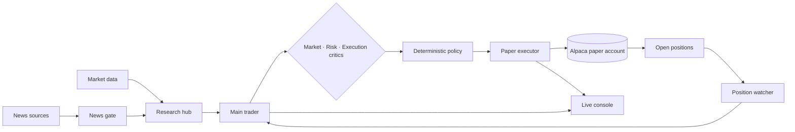

<p align="center">
  <a href="https://alpaca.miposts.com">
    
  </a>
</p>

<h1 align="center">MANDATE</h1>

<p align="center">
  <strong>An autonomous, inspectable trading desk for Alpaca paper markets.</strong><br/>
  Research, hypotheses, risk review, execution and position monitoring in one continuous loop.
</p>

<p align="center">
  <a href="https://alpaca.miposts.com"><strong>Open live console</strong></a>
  &nbsp;·&nbsp;
  <a href="#how-it-works">How it works</a>
  &nbsp;·&nbsp;
  <a href="#run-locally">Run locally</a>
</p>

<p align="center">
  
  
  
  
</p>

> Paper trading only. MANDATE is an engineering and research system, not investment advice. The executor is pinned to Alpaca's paper endpoint; planning agents do not receive broker write tools.

## Product

MANDATE runs a stateful trading desk instead of producing isolated model answers. It keeps a daily strategy, consumes live market and news evidence, watches every open position and records the full path from hypothesis to fill or rejection.

<p align="center">
  <a href="https://alpaca.miposts.com"></a><br/>
  <sub>Representative paper-trading UI state. The public console reads the connected Alpaca paper account live.</sub>
</p>

The console exposes the system at three useful levels:

- **Desk** — equity, exposure, live strategies, working orders and explicit exit policies.
- **Trader room** — the main agent's active hypothesis, evidence, tool results, critic summaries and decisions as a conversation.
- **Operations** — trade ledger, news tape, runtime health and the dependency graph for every agent and deterministic service.

<table>
<tr>
<td width="50%">

**Trader room**


One stream for hypotheses, decisions, watcher results and execution outcomes.

</td>
<td width="50%">

**Trade ledger**


Entries and exits paired by strategy, with size, holding time, mark and P&L.

</td>
</tr>
</table>

## How it works

During the regular session the full loop runs every three minutes, with faster deterministic risk checks between planning cycles. Off-hours research slows to a five-minute cadence and continuously revises the plan for the next open.

<p align="center">
  <br/>
  <sub>Live dependency graph: inputs on the left, the main trader in the center, critics and execution on the right.</sub>
</p>

1. **Sense** — collect Alpaca market data, attributable news, corporate actions, movers and recent IPOs.
2. **Filter** — reject stale, illiquid or irrelevant evidence before it reaches the expensive reasoning path.
3. **Score** — combine momentum, mean reversion, breakout, volume, RSI, MACD and news-price alignment.
4. **Watch** — re-evaluate each open strategy against its original thesis and current market state.
5. **Plan** — the main trader ranks hypotheses and returns a strict, evidence-bound trade plan.
6. **Challenge** — independent market, risk and execution critics test the plan; unavailable critics are never represented as approvals.
7. **Execute** — a deterministic paper-only engine resolves canonical steps, sizes orders, manages fills and journals the result.
8. **Learn** — outcomes and retained decisions feed the next cycle without replaying an unbounded conversation.

## Execution model

The language model proposes intent; it cannot submit orders. Only the local executor can call Alpaca's trading API, after the plan passes schema validation and deterministic limits.



### Invariants

- Paper endpoint is enforced in code; credentials embedded in URLs are rejected.
- Planner and operator agents have no order, cancel, close or exercise tools.
- Stops, targets, expiry protection and session flattening remain deterministic.
- Position and gross exposure, daily loss and order lifecycle checks run immediately before submission.
- Client order IDs are idempotent; stale working orders are recovered or cancelled before replacement.
- Options use defined-risk long premium or debit spreads and share exposure limits with their underlying.
- Invalid, incomplete or ungrounded model output resolves to `PARK`/`HOLD`, never to an inferred trade.

## Repository layout

```text
mandate/
├── agent/          stateful planner, critics, watcher and executor
├── research/       market/news collection and signal computation
├── control-plane/  broker snapshot API and operator endpoints
├── app/            React operations console
├── trueforge/      agent runtime package
├── mandates/       declarative trading policy
└── scripts/        deterministic research and execution helpers

deploy/
├── nginx/          public reverse-proxy configuration
└── systemd/        production service units
```

## Run locally

Requirements: Python 3.12+, Node.js 20+, an Alpaca paper account and credentials for the configured inference provider.

```bash
cp mandate/.env.example .env.local
# Fill ALPACA_API_KEY, ALPACA_SECRET_KEY and model-provider credentials.

python3.12 -m venv .venv
.venv/bin/pip install -e 'mandate/research[test]' -e 'mandate/control-plane[dev]'

cd mandate/agent && npm install && cd ../..
cd mandate/app && npm install && npm run build && cd ../..
cd mandate/trueforge && npm install && cd ../..
```

Start the services in separate shells:

```bash
set -a; source .env.local; set +a
PYTHONPATH=mandate/research/src .venv/bin/python -m mandate_research.server

set -a; source .env.local; set +a
PYTHONPATH=mandate/control-plane/src .venv/bin/python -m mandate_control.dashboard

set -a; source .env.local; set +a
cd mandate/agent && npm run apply && npm run autonomy
```

For a production-style installation, use the nginx and systemd definitions under [`deploy/`](deploy/) and the component notes in [`BUILD.md`](BUILD.md).

## Configuration

[`mandate/.env.example`](mandate/.env.example) documents the runtime contract. The main groups are:

| Group | Examples |
|---|---|
| Broker | `ALPACA_API_KEY`, `ALPACA_SECRET_KEY`, `ALPACA_BASE_URL` |
| Models | `ZAI_API_KEY`, `ZAI_BASE_URL`, trader and critic model names |
| Portfolio | max position, gross exposure, daily loss and order limits |
| Options | DTE, premium risk, spread quality, stops and targets |
| Lifecycle | fill attempts, re-entry cooldown, watcher and critic timeouts |
| Runtime | research, dashboard, TrueForge and Alpaca MCP endpoints |

Never commit `.env.local` or broker/model credentials. Rotate any credential that has appeared in a terminal transcript, screenshot or chat.

## Verification

```bash
cd mandate/research && python -m pytest
cd mandate/control-plane && python -m pytest
cd mandate/agent && npm run typecheck && npm run eval:autonomy
cd mandate/app && npm run typecheck && npm run build
```

## License

MANDATE is released under the [MIT License](LICENSE). You may use, copy, modify, merge, publish, distribute, sublicense, and sell the software, subject to the license terms.

<p align="center">
  <a href="https://alpaca.miposts.com"><strong>Open MANDATE →</strong></a><br/>
  <sub>Autonomous on paper. Observable by design.</sub>
</p>
